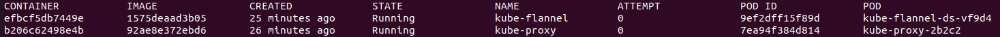

# K8s实践作业

> author: 王浩丞  
> version: 1.0  

## 实验机器
在本地Vmware中创建的两个ubuntu虚拟机，IP分别为`192.168.157.132`和`192.168.157.133`,均在超级用户下执行命令
> 两台机器的hostname均为ubuntu

## Q1: 请记录所有安装步骤的指令，并简要描述其含义
### 安装容器运行时 docker Engine
1. 安装Docker Engine  
    > 由于apt源连接不成功，采用文档中`Install from a package`方法，从[https://download.docker.com/linux/ubuntu/dists/focal/pool/stable/amd64/](https://download.docker.com/linux/ubuntu/dists/focal/pool/stable/amd64/)中下载`containerd.io_1.6.24-1_amd64.deb`, `docker-buildx-plugin_0.14.0-1~ubuntu.20.04~focal_amd64.deb`, `docker-ce_26.1.1-1~ubuntu.20.04~focal_amd64.deb`, `docker-ce-cli_26.1.1-1~ubuntu.20.04~focal_amd64.deb`, `docker-compose-plugin_2.6.0~ubuntu-focal_amd64.deb`, 后进行安装  

    安装指令：  
    ``` sh
    sudo dpkg -i containerd.io_1.6.24-1_amd64.deb \
    docker-ce_26.1.1-1~ubuntu.20.04~focal_amd64.deb \
    docker-ce-cli_26.1.1-1~ubuntu.20.04~focal_amd64.deb \
    docker-buildx-plugin_0.14.0-1~ubuntu.20.04~focal_amd64.deb \
    docker-compose-plugin_2.6.0~ubuntu-focal_amd64.deb \
    ```
2. 安装cri-dockerd  
    在[https://github.com/Mirantis/cri-dockerd/releases](https://github.com/Mirantis/cri-dockerd/releases)上找到对应发布二进制文件包`cri-dockerd-0.3.13.amd64.tgz`,下载到本地解压即可
    > 最好将这个程序交给systemd来作为系统进程后台运行，但是实际为了简单，会直接打开一个新的shell运行  

### 预配制
1. 关闭 swapoff  
    ``` sh
    sudo swapoff -a
    ```
2. 修改时区
    ``` sh
    sudo timedatectl set-timezone Asia/Shanghai
    ```
3. 加载br_netfilter 
    ``` sh
    sudo apt-get install -y bridge-utils
    ```

### 安装 kubeadm kubectl kubelet
1. 安装基本依赖并换源
    ``` sh
    sudo apt-get install -y ca-certificates curl software-properties-common apt-transport-https curl

    curl -s https://mirrors.aliyun.com/kubernetes/apt/doc/apt-key.gpg | sudo apt-key add -

    sudo tee /etc/apt/sources.list.d/kubernetes.list <<EOF
    > deb https://mirrors.aliyun.com/kubernetes/apt/ kubernetes-xenial main
    > EOF
    ```

2. 更新apt软件列表并安装
    ``` sh
    sudo apt-get update
    sudo apt-get install -y kubelet kubeadm kubectl
    ```
3. 禁止自动更新上述组件
    ``` sh
    sudo apt-mark hold kubelet kubeadm kubectl
    ```

### 构建集群
1.  启动cri-dockerd  
    ``` sh
    sudo ./cri-dockerd --pod-infra-container-image=registry.aliyuncs.com/google_containers/pause:3.9
    ```
    > 参数`--pod-infra-container-image`用于指定用于创建 Kubernetes Pod基础设施容器的镜像，如果没有此参数，默认为`registry.k8s.io/pause:3.9`，但是默认image源无法访问，会导致启动kubelet失败，故必须改成国内的pause源
2. 启动master
    ``` sh
    sudo kubeadm init --pod-network-cidr 10.244.0.0/16 \
    --../assets/minik8s_practice_whc/image-repository registry.cn-hangzhou.aliyuncs.com/google_containers \
    --ignore-preflight-errors=... \
    --apiserver-advertise-address 192.168.157.133 \
    --apiserver-bind-port 6443 \
    --cri-socket=unix:///var/run/cri-dockerd.sock
    ```
    > 参数`--cri-socket`用于指定CRI(Container Runtime Interface)的Unix套接字路径，若不指定，会有如下报错：  
    >``` sh
    > Found multiple CRI endpoints on the host. Please define which one do you wish to use by setting the 'criSocket' field in the kubeadm configuration file: 
    > unix:///var/run/containerd/containerd.sock, unix:///var/run/cri-dockerd.sock
    > To see the stack trace of this error execute with --v=5 or higher
    >```
    > 参考文章[https://stackoverflow.com/questions/57868351/kubespray-fails-with-found-multiple-cri-sockets-please-use-cri-socket-to-sel](https://stackoverflow.com/questions/57868351/kubespray-fails-with-found-multiple-cri-sockets-please-use-cri-socket-to-sel)，指定即可

    > --pod-network-cidr需要和后续flannel插件配置文件的可分配子网段匹配，否则会造成flannel的Crash，这里采取了flannel的默认可分配子网段`10.244.0.0/16`

3. 对于 root 用户，执行如下命令，以能够正确使用kubectl
    ```sh
    export KUBECONFIG=/etc/kubernetes/admin.conf
    ```
4. worker加入集群（起另一个节点的shell）
    ```sh
    kubeadm join 192.168.157.133:6443 \
    --node-name worker1 \
    --token gpix2u.cjd7ip32risy32pz \
    --discovery-token-ca-cert-hash sha256:7c425d5af78434216c636d6f1531823f2db388a5b27a260491c178ea650751ce \
    --cri-socket="unix:///var/run/cri-dockerd.sock"
    ```
    > 参数`--node-name`指定这个node的NAME字段，默认为主机名，node主机名不允许一致，否则会导致在worker node上显示join成功，但是master上没有此node的记录（重名只记录一份）  


> 如果kubeadm启动失败，需要先执行
> ```sh
> kubeadm reset --cri-socket="unix:///var/run/cri-dockerd.sock"
> ```
> 后重新运行之前的指令  
> 如果希望将网络配置一并删除，则可根据reset的提示进行操作

### 安装CNI flannel （pod间通信所需网络插件）
```sh
kubectl apply -f https://github.com/flannel-io/flannel/releases/latest/download/kube-flannel.yml
```
> 如果不希望基于插件默认配置运行，可以使用`wget`先将文件拉到本地进行修改，然后apply，后续类似的指令也可使用类似的方法

> 如果本次init之前的网络配置（etc/cni/net.d中内容）没有删除干净，则本次flannel启用后，这些错误配置也无法删除，这会导致 `cri-dockerd`不断尝试删除上次残留内容但不成功，对flannel体现为：启用后coredns不能READY，docker pull总是失败   
故，建议每次init前，除了reset，也清除一下etc/cni/net.d文件夹中的内容

最后，master上运行`kubectl get nodes`,结果如下：
```sh
NAME      STATUS     ROLES           AGE    VERSION
ubuntu    Ready   control-plane   175m   v1.29.4
worker1   Ready   <none>          142m   v1.29.4
```

## Q2: 在两个节点上分别使⽤ ps aux | grep kube 列出所有和k8s相关的进程，记录其输出，并简要说明各个进程的作⽤
Master节点：  
  
worker节点：  

各个进程的作用：
- kube-controller-manager：  
类似minik8s中的controller，通过对各自对象创建各自的controller，并循环监视，尝试使得当前状态->期望状态，来控制集群状态满足用户需求
- kube-scheduler：  
类似minik8s中的schduler，将创建好的pod根据一定的策略分配给一个node，并通知node实际创建这个pod
- kube-apiserver：  
类似minik8s中的api-server，集群中心化组件，与所有其他组件通信，唯一具备控制etcd的组件，实现权限检查与控制功能，并通过与各个组件的通信交流完成来自前后端的各种任务
- kubelet：  
类似minik8s中的kubelet，每个节点上的控制组件，负责创建pod，监控pod状态并报告给api-server，是pod的实际操控者
- kube-proxy：  
类似minik8s中的kube-proxy，主要负责与service和DNS有关的功能，通过配置所属节点网络来实现网络转发等功能
- kube-utils：  
通常用来指代一组用于管理和操作Kubernetes集群的实用工具和脚本。这些工具和脚本可以帮助简化Kubernetes的部署、配置、监控和调试等任务

## Q3: 在两个节点中分别使⽤ crictl ps 显⽰所有正常运⾏的containerd容器，记录其输出，并简要说明各个容器所包含的k8s组件，以及那些k8s组件未运⾏在容器中
Master节点：  
  
Worker节点：  
  
各个容器的作用：  
- coredns：  
k8s的DNS服务器
- flannel类容器：    
使用flannel CNI创建的容器，用于pod间通信
- etcd：    
部署etcd服务，用于集群数据一致性存储
- apiserver：  
部署apiserver服务，提供交互API等功能
- schduler：  
部署schduler服务，用于实际运算调度算法分配node
- kube-proxy：  
部署kube-proxy服务，修改网络规则，实现本节点转发等功能
- kube-controller-manager：  
部署controller服务，通过循环，实际状态->期望状态等方法，控制集群正常运行

## Q4: 请采⽤声明式接⼝对Pod进⾏部署，并将部署所需的yaml⽂件记录在实践⽂档中
创建pod的yaml文件如下，可以通过`kubectl apply -f <filename>`应用:  
```yaml
apiVersion: v1
kind: Pod
metadata:
  name: pod1
  labels:
    app: pod1
spec:
  containers:
    - name: fileserver
      image: 7143192/fileserver:latest
      ports:
        - containerPort: 8080
      volumeMounts:
        - name: share-volume
          mountPath: /usr/share/files
    - name: downloader
      image: 7143192/downloader:latest
      ports:
        - containerPort: 3000
      volumeMounts:
        - name: share-volume
          mountPath: /data
  volumes:
    - name: share-volume
      emptyDir: {}
```

## Q5: 请在worker节点上，在部署Pod的前后分别采⽤ crictl ps 查看所有运⾏中的容器并对⽐两者的区别。请将创建该Pod所创建的全部新容器列举出来，并⼀⼀解释其作⽤
创建后pod如下：  
  

Worker Node上执行crictl ps变化如下：  
    
可以看到，容器中新增了创建的fileserver和downloader  
> 实际上应该还有创建的pause容器，但是crictl ps并不会列出

## Q6: 请结合博客 https://blog.51cto.com/u_15069443/4043930 的内容，将容器中的veth与host机器上的veth匹配起来，并采⽤ ip link 和 ip addr 指令找到位于host机器中的所有⽹络设备及其之间的关系。结合两者的输出，试绘制出worker节点中涉及新部署Pod的所有⽹络设备和其⽹络结构，并在图中标注出从master节点中使⽤pod ip访问位于worker节点中的Pod的⽹络路径
downloader容器中：    
   
fileserver容器中：    
  
worker node宿主机中：    
    

参考[https://dustinspecker.com/posts/how-do-kubernetes-and-docker-create-ip-addresses/](https://dustinspecker.com/posts/how-do-kubernetes-and-docker-create-ip-addresses/),linux采取创建并绑定virtual ethernet devices对的方式，建立不同network namespce之间的信息通道，宿主机上的veth将由虚拟网桥设备整合，如下图所示：  
    
因为上述两个容器所属同一个pod,也即其加入了同一个pause容器的network namespace中，根据上述绑定关系，容器和宿主机network namespace之间的veth对应关系为：  
容器中`2: eth0@if6`对应宿主机中`6： vethe358f9b7@if2`  

在宿主机中还可以看到一个新的虚拟网络接口设备`flannel.1`，并为其分配ip route规则，使得集群pod之间能够不使用nat技术进行通信，参考[https://www.zhihu.com/tardis/zm/art/140711132?source_id=1003](https://www.zhihu.com/tardis/zm/art/140711132?source_id=1003),其网络结构如下：  
  

从master节点中使用pod ip访问位于worker节点中的Pod的网络路径如下：  
  


## Q7: 请采⽤声明式接⼝对Deployment进⾏部署，并将Deployment所需要的yaml⽂件记录在⽂档中
创建deployment的yaml文件如下，可以通过`kubectl apply -f <filename>`应用:   
```yaml
apiVersion: apps/v1
kind: Deployment
metadata:
  name: deployment1
spec:
  replicas: 3
  selector:
    matchLabels:
      app: app2
  template:
    metadata:
      labels:
        app: app2
    spec:
      containers:
        - name: fileserver
          image: 7143192/fileserver:latest
          ports:
            - containerPort: 8080
          volumeMounts:
            - name: share-volume
              mountPath: /usr/share/files
        - name: downloader
          image: 7143192/downloader:latest
          ports:
            - containerPort: 3000
          volumeMounts:
            - name: share-volume
              mountPath: /data
      volumes:
        - name: share-volume
          emptyDir: {}
```
deployment创建后，pod和deployment部分如下：  
  
  
可以看到，deployment成功创建，且对应要求的pod也被真正拉起3份副本  

## Q8: 在该使⽤Deployment的部署⽅式下，不同Pod之间的⽂件是否共享？该情况会在实际使⽤⽂件下载与共享服务时产⽣怎样的实际效果与问题？应如何解决这⼀问题？
该deployment配置下，卷只能在同一个节点上的同一pod的不同容器之间共享，并且当pod终止时，该卷上的所有数据都将被删除，这种情况会导致：
1. 共享/下载的文件不能真正持久化存储，会随着pod的终止而被删除
2. 不同pod功能一致，理论上应该作为一个整体对外暴露服务，但是在volume不共享的设置下，如果两次请求被负载到不同的pod，可能会出现用户视角的不一致问题（如下载了一个文件在某个pod,而查看下载文件时负载到了另一个pod导致未找到刚才下载的文件）

基于上述问题，我们可以采取使用PV和PVC对象的方式来解决问题，PV和PVC作为k8s中的一种存储抽象，不属于任何一个Namespace，逻辑和实现上均具备共享性质  

## Q9: 请采⽤声明式接⼝对Service进⾏部署，并将部署所需的yaml⽂件记录在实践⽂档中
创建service的yaml文件如下，可以通过`kubectl apply -f <filename>`应用:   
```yaml
apiVersion: v1
kind: Service
metadata:
  name: service1
spec:
  selector:
    app: app2
  ports:
    - port: 8080
      targetPort: 8080
      name: fileserver
    - port: 3000
      targetPort: 3000
      name: downloader
```
创建后service展示如下，集群内`curl`请求虚拟IP服务效果如下：  
  
   
可以看到均符合预期  

## Q10: 请在master节点中使⽤ iptables-save 指令输出所有的iptables规则，将其中与Service访问相关的iptable规则记录在实践⽂档中，并解释⽹络流量是如何采⽤基于iptables的⽅式被从对Service的clusterIP的访问定向到实际的Pod中的，⼜是如何实现负载均衡到三个pod的。
通过`sudo iptables-save`创建iptables存档：  
```sh
# Generated by iptables-save v1.8.4 on Thu May  9 00:31:58 2024
*mangle
:PREROUTING ACCEPT [218188:41890116]
:INPUT ACCEPT [217805:41843480]
:FORWARD ACCEPT [383:46636]
:OUTPUT ACCEPT [217524:42907487]
:POSTROUTING ACCEPT [217958:42959480]
:KUBE-IPTABLES-HINT - [0:0]
:KUBE-KUBELET-CANARY - [0:0]
:KUBE-PROXY-CANARY - [0:0]
COMMIT
# Completed on Thu May  9 00:31:58 2024
# Generated by iptables-save v1.8.4 on Thu May  9 00:31:58 2024
*filter
:INPUT ACCEPT [16310:2657175]
:FORWARD DROP [0:0]
:OUTPUT ACCEPT [16281:2688980]
:DOCKER - [0:0]
:DOCKER-ISOLATION-STAGE-1 - [0:0]
:DOCKER-ISOLATION-STAGE-2 - [0:0]
:DOCKER-USER - [0:0]
:FLANNEL-FWD - [0:0]
:KUBE-EXTERNAL-SERVICES - [0:0]
:KUBE-FIREWALL - [0:0]
:KUBE-FORWARD - [0:0]
:KUBE-KUBELET-CANARY - [0:0]
:KUBE-NODEPORTS - [0:0]
:KUBE-PROXY-CANARY - [0:0]
:KUBE-PROXY-FIREWALL - [0:0]
:KUBE-SERVICES - [0:0]
-A INPUT -m conntrack --ctstate NEW -m comment --comment "kubernetes load balancer firewall" -j KUBE-PROXY-FIREWALL
-A INPUT -m comment --comment "kubernetes health check service ports" -j KUBE-NODEPORTS
-A INPUT -m conntrack --ctstate NEW -m comment --comment "kubernetes externally-visible service portals" -j KUBE-EXTERNAL-SERVICES
-A INPUT -j KUBE-FIREWALL
-A FORWARD -m conntrack --ctstate NEW -m comment --comment "kubernetes load balancer firewall" -j KUBE-PROXY-FIREWALL
-A FORWARD -m comment --comment "kubernetes forwarding rules" -j KUBE-FORWARD
-A FORWARD -m conntrack --ctstate NEW -m comment --comment "kubernetes service portals" -j KUBE-SERVICES
-A FORWARD -m conntrack --ctstate NEW -m comment --comment "kubernetes externally-visible service portals" -j KUBE-EXTERNAL-SERVICES
-A FORWARD -j DOCKER-USER
-A FORWARD -j DOCKER-ISOLATION-STAGE-1
-A FORWARD -o docker0 -m conntrack --ctstate RELATED,ESTABLISHED -j ACCEPT
-A FORWARD -o docker0 -j DOCKER
-A FORWARD -i docker0 ! -o docker0 -j ACCEPT
-A FORWARD -i docker0 -o docker0 -j ACCEPT
-A FORWARD -m comment --comment "flanneld forward" -j FLANNEL-FWD
-A OUTPUT -m conntrack --ctstate NEW -m comment --comment "kubernetes load balancer firewall" -j KUBE-PROXY-FIREWALL
-A OUTPUT -m conntrack --ctstate NEW -m comment --comment "kubernetes service portals" -j KUBE-SERVICES
-A OUTPUT -j KUBE-FIREWALL
-A DOCKER-ISOLATION-STAGE-1 -i docker0 ! -o docker0 -j DOCKER-ISOLATION-STAGE-2
-A DOCKER-ISOLATION-STAGE-1 -j RETURN
-A DOCKER-ISOLATION-STAGE-2 -o docker0 -j DROP
-A DOCKER-ISOLATION-STAGE-2 -j RETURN
-A DOCKER-USER -j RETURN
-A FLANNEL-FWD -s 10.244.0.0/16 -m comment --comment "flanneld forward" -j ACCEPT
-A FLANNEL-FWD -d 10.244.0.0/16 -m comment --comment "flanneld forward" -j ACCEPT
-A KUBE-FIREWALL ! -s 127.0.0.0/8 -d 127.0.0.0/8 -m comment --comment "block incoming localnet connections" -m conntrack ! --ctstate RELATED,ESTABLISHED,DNAT -j DROP
-A KUBE-FORWARD -m conntrack --ctstate INVALID -j DROP
-A KUBE-FORWARD -m comment --comment "kubernetes forwarding rules" -m mark --mark 0x4000/0x4000 -j ACCEPT
-A KUBE-FORWARD -m comment --comment "kubernetes forwarding conntrack rule" -m conntrack --ctstate RELATED,ESTABLISHED -j ACCEPT
COMMIT
# Completed on Thu May  9 00:31:58 2024
# Generated by iptables-save v1.8.4 on Thu May  9 00:31:58 2024
*nat
:PREROUTING ACCEPT [0:0]
:INPUT ACCEPT [0:0]
:OUTPUT ACCEPT [202:12151]
:POSTROUTING ACCEPT [202:12151]
:DOCKER - [0:0]
:FLANNEL-POSTRTG - [0:0]
:KUBE-KUBELET-CANARY - [0:0]
:KUBE-MARK-MASQ - [0:0]
:KUBE-NODEPORTS - [0:0]
:KUBE-POSTROUTING - [0:0]
:KUBE-PROXY-CANARY - [0:0]
:KUBE-SEP-3WH7PNCF552PK7QF - [0:0]
:KUBE-SEP-5RGOO3QK7HUWX7JR - [0:0]
:KUBE-SEP-BMXIWDGCUXES4RXU - [0:0]
:KUBE-SEP-DQ3TQJSNULRJFVPB - [0:0]
:KUBE-SEP-FVQSBIWR5JTECIVC - [0:0]
:KUBE-SEP-GNPLBMAPMBAWZWRV - [0:0]
:KUBE-SEP-LADV24EFL6BSD2AA - [0:0]
:KUBE-SEP-LASJGFFJP3UOS6RQ - [0:0]
:KUBE-SEP-LPGSDLJ3FDW46N4W - [0:0]
:KUBE-SEP-PUHFDAMRBZWCPADU - [0:0]
:KUBE-SEP-SAA7F5BCHTGMFCIJ - [0:0]
:KUBE-SEP-SF3LG62VAE5ALYDV - [0:0]
:KUBE-SEP-WXWGHGKZOCNYRYI7 - [0:0]
:KUBE-SERVICES - [0:0]
:KUBE-SVC-ERIFXISQEP7F7OF4 - [0:0]
:KUBE-SVC-JD5MR3NA4I4DYORP - [0:0]
:KUBE-SVC-NPX46M4PTMTKRN6Y - [0:0]
:KUBE-SVC-TCOU7JCQXEZGVUNU - [0:0]
:KUBE-SVC-XFIT55N4IPARHPG5 - [0:0]
:KUBE-SVC-YJOPSEYCAQBFRA2J - [0:0]
-A PREROUTING -m comment --comment "kubernetes service portals" -j KUBE-SERVICES
-A PREROUTING -m addrtype --dst-type LOCAL -j DOCKER
-A OUTPUT -m comment --comment "kubernetes service portals" -j KUBE-SERVICES
-A OUTPUT ! -d 127.0.0.0/8 -m addrtype --dst-type LOCAL -j DOCKER
-A POSTROUTING -m comment --comment "kubernetes postrouting rules" -j KUBE-POSTROUTING
-A POSTROUTING -s 172.17.0.0/16 ! -o docker0 -j MASQUERADE
-A POSTROUTING -m comment --comment "flanneld masq" -j FLANNEL-POSTRTG
-A DOCKER -i docker0 -j RETURN
-A FLANNEL-POSTRTG -m mark --mark 0x4000/0x4000 -m comment --comment "flanneld masq" -j RETURN
-A FLANNEL-POSTRTG -s 10.244.0.0/24 -d 10.244.0.0/16 -m comment --comment "flanneld masq" -j RETURN
-A FLANNEL-POSTRTG -s 10.244.0.0/16 -d 10.244.0.0/24 -m comment --comment "flanneld masq" -j RETURN
-A FLANNEL-POSTRTG ! -s 10.244.0.0/16 -d 10.244.0.0/24 -m comment --comment "flanneld masq" -j RETURN
-A FLANNEL-POSTRTG -s 10.244.0.0/16 ! -d 224.0.0.0/4 -m comment --comment "flanneld masq" -j MASQUERADE --random-fully
-A FLANNEL-POSTRTG ! -s 10.244.0.0/16 -d 10.244.0.0/16 -m comment --comment "flanneld masq" -j MASQUERADE --random-fully
-A KUBE-MARK-MASQ -j MARK --set-xmark 0x4000/0x4000
-A KUBE-POSTROUTING -m mark ! --mark 0x4000/0x4000 -j RETURN
-A KUBE-POSTROUTING -j MARK --set-xmark 0x4000/0x0
-A KUBE-POSTROUTING -m comment --comment "kubernetes service traffic requiring SNAT" -j MASQUERADE --random-fully
-A KUBE-SEP-3WH7PNCF552PK7QF -s 10.244.1.5/32 -m comment --comment "default/service1:fileserver" -j KUBE-MARK-MASQ
-A KUBE-SEP-3WH7PNCF552PK7QF -p tcp -m comment --comment "default/service1:fileserver" -m tcp -j DNAT --to-destination 10.244.1.5:8080
-A KUBE-SEP-5RGOO3QK7HUWX7JR -s 10.244.1.4/32 -m comment --comment "default/service1:fileserver" -j KUBE-MARK-MASQ
-A KUBE-SEP-5RGOO3QK7HUWX7JR -p tcp -m comment --comment "default/service1:fileserver" -m tcp -j DNAT --to-destination 10.244.1.4:8080
-A KUBE-SEP-BMXIWDGCUXES4RXU -s 10.244.1.6/32 -m comment --comment "default/service1:downloader" -j KUBE-MARK-MASQ
-A KUBE-SEP-BMXIWDGCUXES4RXU -p tcp -m comment --comment "default/service1:downloader" -m tcp -j DNAT --to-destination 10.244.1.6:3000
-A KUBE-SEP-DQ3TQJSNULRJFVPB -s 10.244.1.6/32 -m comment --comment "default/service1:fileserver" -j KUBE-MARK-MASQ
-A KUBE-SEP-DQ3TQJSNULRJFVPB -p tcp -m comment --comment "default/service1:fileserver" -m tcp -j DNAT --to-destination 10.244.1.6:8080
-A KUBE-SEP-FVQSBIWR5JTECIVC -s 10.244.0.5/32 -m comment --comment "kube-system/kube-dns:metrics" -j KUBE-MARK-MASQ
-A KUBE-SEP-FVQSBIWR5JTECIVC -p tcp -m comment --comment "kube-system/kube-dns:metrics" -m tcp -j DNAT --to-destination 10.244.0.5:9153
-A KUBE-SEP-GNPLBMAPMBAWZWRV -s 10.244.1.5/32 -m comment --comment "default/service1:downloader" -j KUBE-MARK-MASQ
-A KUBE-SEP-GNPLBMAPMBAWZWRV -p tcp -m comment --comment "default/service1:downloader" -m tcp -j DNAT --to-destination 10.244.1.5:3000
-A KUBE-SEP-LADV24EFL6BSD2AA -s 10.244.1.4/32 -m comment --comment "default/service1:downloader" -j KUBE-MARK-MASQ
-A KUBE-SEP-LADV24EFL6BSD2AA -p tcp -m comment --comment "default/service1:downloader" -m tcp -j DNAT --to-destination 10.244.1.4:3000
-A KUBE-SEP-LASJGFFJP3UOS6RQ -s 10.244.0.5/32 -m comment --comment "kube-system/kube-dns:dns-tcp" -j KUBE-MARK-MASQ
-A KUBE-SEP-LASJGFFJP3UOS6RQ -p tcp -m comment --comment "kube-system/kube-dns:dns-tcp" -m tcp -j DNAT --to-destination 10.244.0.5:53
-A KUBE-SEP-LPGSDLJ3FDW46N4W -s 10.244.0.5/32 -m comment --comment "kube-system/kube-dns:dns" -j KUBE-MARK-MASQ
-A KUBE-SEP-LPGSDLJ3FDW46N4W -p udp -m comment --comment "kube-system/kube-dns:dns" -m udp -j DNAT --to-destination 10.244.0.5:53
-A KUBE-SEP-PUHFDAMRBZWCPADU -s 10.244.0.4/32 -m comment --comment "kube-system/kube-dns:metrics" -j KUBE-MARK-MASQ
-A KUBE-SEP-PUHFDAMRBZWCPADU -p tcp -m comment --comment "kube-system/kube-dns:metrics" -m tcp -j DNAT --to-destination 10.244.0.4:9153
-A KUBE-SEP-SAA7F5BCHTGMFCIJ -s 192.168.157.133/32 -m comment --comment "default/kubernetes:https" -j KUBE-MARK-MASQ
-A KUBE-SEP-SAA7F5BCHTGMFCIJ -p tcp -m comment --comment "default/kubernetes:https" -m tcp -j DNAT --to-destination 192.168.157.133:6443
-A KUBE-SEP-SF3LG62VAE5ALYDV -s 10.244.0.4/32 -m comment --comment "kube-system/kube-dns:dns-tcp" -j KUBE-MARK-MASQ
-A KUBE-SEP-SF3LG62VAE5ALYDV -p tcp -m comment --comment "kube-system/kube-dns:dns-tcp" -m tcp -j DNAT --to-destination 10.244.0.4:53
-A KUBE-SEP-WXWGHGKZOCNYRYI7 -s 10.244.0.4/32 -m comment --comment "kube-system/kube-dns:dns" -j KUBE-MARK-MASQ
-A KUBE-SEP-WXWGHGKZOCNYRYI7 -p udp -m comment --comment "kube-system/kube-dns:dns" -m udp -j DNAT --to-destination 10.244.0.4:53
-A KUBE-SERVICES -d 10.96.0.1/32 -p tcp -m comment --comment "default/kubernetes:https cluster IP" -m tcp --dport 443 -j KUBE-SVC-NPX46M4PTMTKRN6Y
-A KUBE-SERVICES -d 10.96.0.10/32 -p tcp -m comment --comment "kube-system/kube-dns:dns-tcp cluster IP" -m tcp --dport 53 -j KUBE-SVC-ERIFXISQEP7F7OF4
-A KUBE-SERVICES -d 10.96.0.10/32 -p tcp -m comment --comment "kube-system/kube-dns:metrics cluster IP" -m tcp --dport 9153 -j KUBE-SVC-JD5MR3NA4I4DYORP
-A KUBE-SERVICES -d 10.96.0.10/32 -p udp -m comment --comment "kube-system/kube-dns:dns cluster IP" -m udp --dport 53 -j KUBE-SVC-TCOU7JCQXEZGVUNU
-A KUBE-SERVICES -d 10.108.64.11/32 -p tcp -m comment --comment "default/service1:fileserver cluster IP" -m tcp --dport 8080 -j KUBE-SVC-YJOPSEYCAQBFRA2J
-A KUBE-SERVICES -d 10.108.64.11/32 -p tcp -m comment --comment "default/service1:downloader cluster IP" -m tcp --dport 3000 -j KUBE-SVC-XFIT55N4IPARHPG5
-A KUBE-SERVICES -m comment --comment "kubernetes service nodeports; NOTE: this must be the last rule in this chain" -m addrtype --dst-type LOCAL -j KUBE-NODEPORTS
-A KUBE-SVC-ERIFXISQEP7F7OF4 ! -s 10.244.0.0/16 -d 10.96.0.10/32 -p tcp -m comment --comment "kube-system/kube-dns:dns-tcp cluster IP" -m tcp --dport 53 -j KUBE-MARK-MASQ
-A KUBE-SVC-ERIFXISQEP7F7OF4 -m comment --comment "kube-system/kube-dns:dns-tcp -> 10.244.0.4:53" -m statistic --mode random --probability 0.50000000000 -j KUBE-SEP-SF3LG62VAE5ALYDV
-A KUBE-SVC-ERIFXISQEP7F7OF4 -m comment --comment "kube-system/kube-dns:dns-tcp -> 10.244.0.5:53" -j KUBE-SEP-LASJGFFJP3UOS6RQ
-A KUBE-SVC-JD5MR3NA4I4DYORP ! -s 10.244.0.0/16 -d 10.96.0.10/32 -p tcp -m comment --comment "kube-system/kube-dns:metrics cluster IP" -m tcp --dport 9153 -j KUBE-MARK-MASQ
-A KUBE-SVC-JD5MR3NA4I4DYORP -m comment --comment "kube-system/kube-dns:metrics -> 10.244.0.4:9153" -m statistic --mode random --probability 0.50000000000 -j KUBE-SEP-PUHFDAMRBZWCPADU
-A KUBE-SVC-JD5MR3NA4I4DYORP -m comment --comment "kube-system/kube-dns:metrics -> 10.244.0.5:9153" -j KUBE-SEP-FVQSBIWR5JTECIVC
-A KUBE-SVC-NPX46M4PTMTKRN6Y ! -s 10.244.0.0/16 -d 10.96.0.1/32 -p tcp -m comment --comment "default/kubernetes:https cluster IP" -m tcp --dport 443 -j KUBE-MARK-MASQ
-A KUBE-SVC-NPX46M4PTMTKRN6Y -m comment --comment "default/kubernetes:https -> 192.168.157.133:6443" -j KUBE-SEP-SAA7F5BCHTGMFCIJ
-A KUBE-SVC-TCOU7JCQXEZGVUNU ! -s 10.244.0.0/16 -d 10.96.0.10/32 -p udp -m comment --comment "kube-system/kube-dns:dns cluster IP" -m udp --dport 53 -j KUBE-MARK-MASQ
-A KUBE-SVC-TCOU7JCQXEZGVUNU -m comment --comment "kube-system/kube-dns:dns -> 10.244.0.4:53" -m statistic --mode random --probability 0.50000000000 -j KUBE-SEP-WXWGHGKZOCNYRYI7
-A KUBE-SVC-TCOU7JCQXEZGVUNU -m comment --comment "kube-system/kube-dns:dns -> 10.244.0.5:53" -j KUBE-SEP-LPGSDLJ3FDW46N4W
-A KUBE-SVC-XFIT55N4IPARHPG5 ! -s 10.244.0.0/16 -d 10.108.64.11/32 -p tcp -m comment --comment "default/service1:downloader cluster IP" -m tcp --dport 3000 -j KUBE-MARK-MASQ
-A KUBE-SVC-XFIT55N4IPARHPG5 -m comment --comment "default/service1:downloader -> 10.244.1.4:3000" -m statistic --mode random --probability 0.33333333349 -j KUBE-SEP-LADV24EFL6BSD2AA
-A KUBE-SVC-XFIT55N4IPARHPG5 -m comment --comment "default/service1:downloader -> 10.244.1.5:3000" -m statistic --mode random --probability 0.50000000000 -j KUBE-SEP-GNPLBMAPMBAWZWRV
-A KUBE-SVC-XFIT55N4IPARHPG5 -m comment --comment "default/service1:downloader -> 10.244.1.6:3000" -j KUBE-SEP-BMXIWDGCUXES4RXU
-A KUBE-SVC-YJOPSEYCAQBFRA2J ! -s 10.244.0.0/16 -d 10.108.64.11/32 -p tcp -m comment --comment "default/service1:fileserver cluster IP" -m tcp --dport 8080 -j KUBE-MARK-MASQ
-A KUBE-SVC-YJOPSEYCAQBFRA2J -m comment --comment "default/service1:fileserver -> 10.244.1.4:8080" -m statistic --mode random --probability 0.33333333349 -j KUBE-SEP-5RGOO3QK7HUWX7JR
-A KUBE-SVC-YJOPSEYCAQBFRA2J -m comment --comment "default/service1:fileserver -> 10.244.1.5:8080" -m statistic --mode random --probability 0.50000000000 -j KUBE-SEP-3WH7PNCF552PK7QF
-A KUBE-SVC-YJOPSEYCAQBFRA2J -m comment --comment "default/service1:fileserver -> 10.244.1.6:8080" -j KUBE-SEP-DQ3TQJSNULRJFVPB
COMMIT
# Completed on Thu May  9 00:31:58 2024
```
Cluster创建的虚拟IP只在集群内有效。从iptables来看，即机器只有针对这些虚拟IP配置好本地iptables的转发规则，才能实现访问服务时的流量转发   
k8s的iptables比较复杂，这里只解释有关网络包destination重定向的部分规则，主要集中在`nat`表中：
1. 在原装链PREROUTING和OUTPUT中加入一条规则，使得所有的网络包需要进入子链KUBE-SERVICE并经过其中的一系列规则
2. KUBE-SERVICES中有多条规则，分别匹配不同的service上的虚拟IP+虚拟port,并在匹配成功后跳转至其下子链KUBE-SVC-XXX，每条KUBE-SVC-XXX链对应一个service开放的一个端口，即一种服务
3. KUBE-SVC-XXX下集合了多条KUBE-SEP-XXX链，每条KUBE-SEP-XXX链对应一个endpoint  
   KUBE-SVC-XXX还具备负载均衡方法，具体采用了iptables-external中的statistic模式，其支持random和round-robin两种负载模式，以上述存档为例，通过指定负载模式为random,并指定概率即可。注意，这个负载均衡策略只需要在每条KUBE-SVC-XXX的第一条规则中指定，其会应用到该链后续的所有规则中（如果有后续规则重写负载策略，将会在后续的规则中覆盖更早的负载均衡策略）
4. KUBE-SEP-XXX是实际DNAT的链，会直接修改包的destination（前面的规则已经筛选过了）

这样，对ClusterIP的服务请求先进入PREROUTING中，在匹配到对应的ip+port后跳转进入对应的KUBE-SVC-XXX链中，然后在其中负载均衡，转到一个KUBE-SEP-XXX中，并在其中被修改destination,以重定向到此service下的一个endponit中  

## Q11: kube-proxy组件在整个service的定义与实现过程中起到了什么作⽤？请⾃⾏查找资料，并解释在iptables模式下，kube-proxy的功能
在k8s的视角中，kube-proxy实际控制了所属node的流量转发规则。而实际上，其又是通过netfilter的前端之一 —— iptables来实现的   

参考[https://www.bookstack.cn/read/source-code-reading-notes/kubernetes-kube_proxy_process.md](https://www.bookstack.cn/read/source-code-reading-notes/kubernetes-kube_proxy_process.md),kube-proxy会以轮询或者被唤醒的机制，请求etcd里的service和对应的endpoint数据，并利用这些数据不断更新本地防火墙规则,以实现流量转发


## Q12&Q13: 请在上⾯部署的Deployment的基础上为其配置HPA，并将部署所需的yaml⽂件记录在实践⽂档中，如果对上⾯的Deployment配置有修改也请在⽂档中说明。具体参数为最⼤副本数为6，最⼩副本数为3，⽬标cpu平均利⽤率为40% & ⼩明发现，hpa缩容过快在负载抖动的情况下会引起pod被不必要地删除和再次创建，因此他决定限制缩容的速率，请为hpa配置缩容的速率限制为每分钟 10%，并将部署所需的yaml⽂件记录在实践⽂档中
### 安装metrics-server
metrics-server是本任务引入的新的k8s插件，但是基于默认配置无法正常创建，需要进行自定义配置，具体方法参考文章[https://cloud.tencent.com/developer/article/1818865](https://cloud.tencent.com/developer/article/1818865)： 
1. 执行`wget https://github.com/kubernetes-sigs/metrics-server/releases/latest/download/high-availability-1.21+.yaml`，将配置文件拉至本地
2. 针对metrics-server官方镜像源不可访问的问题，首先在拉下的默认配置文件中找到image版本（我的是v0.7.1），随后在docker hub上搜索`metrics-server:v0.7.1`，找到了一个fork的镜像[https://hub.docker.com/r/bishoyanwar24/metrics-server/tags](https://hub.docker.com/r/bishoyanwar24/metrics-server/tags)，将配置中的镜像源替换为新找到的源
3. 按照文章修改其他部分
4. 运行`kubectl apply -f`发现有一个metrics-server是pending状态，另一个已经正常runing，参考[https://blog.csdn.net/qq_18287147/article/details/105179898](https://blog.csdn.net/qq_18287147/article/details/105179898)，为控制平面删除traint后，恢复正常  

最后安装效果如下：    
    

### 更新deployment1
```yaml
apiVersion: apps/v1
kind: Deployment
metadata:
  name: deployment1
  labels:
    app: app2
spec:
  #replicas: 3
  selector:
    matchLabels:
      app: app2
  template:
    metadata:
      labels:
        app: app2
    spec:
      containers:
        - name: fileserver
          image: 7143192/fileserver:latest
          ports:
            - containerPort: 8080
          volumeMounts:
            - name: share-volume
              mountPath: /usr/share/files
          resources:
            limits:
              cpu: 500m
            requests:
              cpu: 200m
        - name: downloader
          image: 7143192/downloader:latest
          ports:
            - containerPort: 3000
          volumeMounts:
            - name: share-volume
              mountPath: /data
          resources:
            limits:
              cpu: 500m
            requests:
              cpu: 200m
      volumes:
        - name: share-volume
          emptyDir: {}
```

### 创建HPA 
```yaml
apiVersion: autoscaling/v2
kind: HorizontalPodAutoscaler
metadata:
  name: hpa1
spec:
  scaleTargetRef:
    apiVersion: apps/v1
    kind: Deployment
    name: deployment1
  minReplicas: 3
  maxReplicas: 6
  metrics:
    - type: Resource
      resource:
        name: cpu
        target:
          type: Utilization
          averageUtilization: 40
  behavior:
    scaleDown:
      policies:
        - type: Percent
          value: 10
          periodSeconds: 60
```

创建完后，结果如下：  
   


### 负载变动测试  
编写了一个简单的基于c的压力测试程序，通过循环fork产生512个进程，每个进程向HPA对应的service循环请求200次服务，源码如下： 
```c
#include <stdio.h>
#include <stdlib.h>
#include <unistd.h>
int main() {
	for (int i = 0; i < 9; i++) {
    		fork();
	}
	for(int i=0;i<200;++i){
		system("curl 10.108.64.11:3000");
	}
    	return 0;
}
```
执行结果：  
   
可以看到负载是有变动的，但是受限于所创建虚拟机的配置，无论是使单个压测程序fork更多次，还是同时开多个压测程序，都不能更密集的发送请求  

为了看到过负载导致的动态伸缩现象，我们降低目标CPU平均利用率至3%，随后重新进行压测，结果如下：    
    
可以看到产生了明显的动态扩容效果  


<!-- ## 最后
首先，为配了半天的虚拟机留个纪念！  

配k8s是一个不能糊弄，也异常艰难的过程。特别是在实体机性能不算强，VMware各种崩的情况下。基本上每隔几个小时，VMware的网络就会全部崩溃，无法连接公网，只能重启一次，然后从头再配。甚至还出现了一次虚拟机crash导致windows一并carsh的情况    
而换源不成功、网络请求不稳定、插件文档缺失、各模块版本不兼容、k8s官方文档过于繁杂、没有清晰的检测配置错误的思路等等问题也是令人头疼不已   
不过最后还是成功拉起了k8s的小型集群，还是收获满满的！   -->